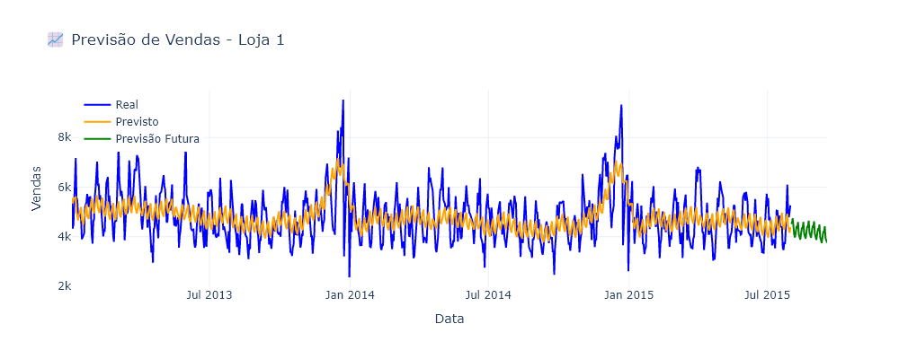
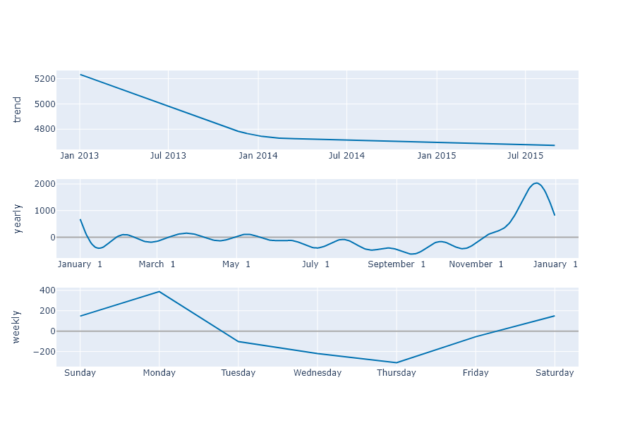
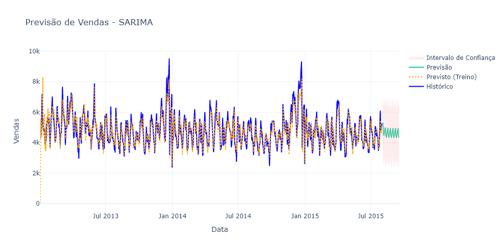
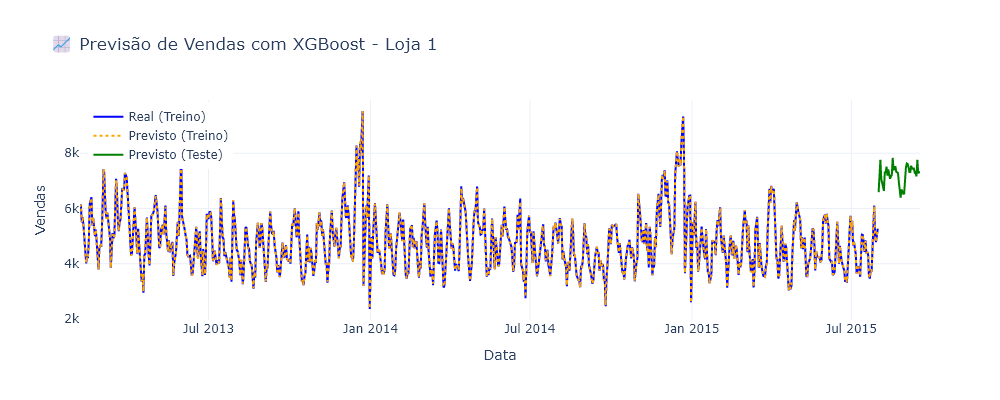

# Previsão de Vendas com Séries Temporais no Varejo

### 🎯 Objetivo do Projeto

Este projeto tem como objetivo prever as vendas diárias de uma rede de lojas utilizando **modelos de séries temporais** . A previsão permite ao negócio tomar decisões estratégicas sobre **estoque, demanda, promoções e logística** .

---

### ⚙️Criando env

```
conda create --name cases_data_science python=3.10
conda activate cases_data_science
```

Se precisar deletar env

```
conda remove --name cases_data_science --all
```

Exportar notebook para md

```
jupyter nbconvert notebook.ipynb --to markdown --no-input

```

Criando env com environment.yml

```
conda env create -f environment.yml
conda activate nome_env
```

---

### 📊 Fonte e Explicação dos Dados

- **Fonte:** [Rossmann Store Sales Dataset – Kaggle](https://www.kaggle.com/c/rossmann-store-sales/data)
- **Descrição:** Contém dados de vendas diárias por loja, com informações sobre promoções, feriados, abertura/fechamento, etc.
- **Colunas principais:** `Date`, `Store`, `Sales`, `Promo`, `StateHoliday`, `SchoolHoliday`, `Customers`, `Open`

Dataset excelente para modelagem de séries temporais reais, incluindo fatores externos.

---

### 📁 Estrutura de Pastas e Arquivos

```
sales-forecasting-time-series-retail/
│
├── data/
│   ├── raw/                   # Dados originais do Kaggle
│   └── processed/             # Dados tratados e prontos para modelagem
│
├── notebooks/
│   ├── 01_exploration.ipynb   # EDA com visualização de séries temporais
│   ├── 02_preprocessing.ipynb # Tratamento, agregações, criação de features
│   ├── 03_modeling.ipynb      # Modelagem com Prophet, ARIMA ou XGBoost
│   ├── 04_forecast.ipynb      # Previsões e avaliação do modelo
│
├── reports/
│   └── figures/               # Visualizações, gráficos e previsões salvas
│
├── requirements.txt
└── README.md
```

---

### 🔁 Etapas do Processo

1. **Coleta de Dados**
   - Download via Kaggle API ou manual
   - Seleção da loja com maior volume de vendas para foco
2. **Tratamento e Engenharia de Features**
   - Conversão de datas, criação de variáveis como `dia da semana`, `mês`, `tendência`, `promo`, etc.
   - Agregações diárias por loja
3. **Análise Exploratória (EDA)**
   - Visualização de tendências, sazonalidade, feriados e eventos
4. **Modelagem e Previsão**
   - Aplicação de modelos como:
     - `Prophet` (Facebook)
     - `ARIMA/SARIMA` com `statsmodels`
     - `XGBoost Regressor` com features temporais
   - Avaliação com RMSE, MAPE e gráficos de previsão
5. **Interpretação dos Resultados**
   - Apresentação dos melhores modelos e impacto de promoções/feriados

---

### ⚙️ Como Executar Localmente

1. Clone o repositório:

```
git clone https://github.com/seuusuario/sales-forecasting-time-series-retail.git
cd sales-forecasting-time-series-retail
```

2. Crie um ambiente virtual (opcional) e instale as dependências:

```
pip install -r requirements.txt
```

3. Inicie os notebooks:
   ```
   jupyter notebook
   ```

Execute os notebooks na seguinte ordem para reproduzir o projeto:

- `01_exploration.ipynb`
- `02_preprocessing.ipynb`
- `03_modeling.ipynb`
- `04_forecast.ipynb`
- `05_arima-sarima.ipynb`
- `06_xgboost.ipynb`

---

### 📊 Salvar gráficos

Plotly precisa da biblioteca **kaleido** para exportar gráficos como imagem:

```
pip install -U kaleido
```

---

## ✅ Resultados

### 📊 Modelos de Previsão de Vendas

O objetivo foi prever as vendas da Loja 1 utilizando diferentes abordagens de modelagem temporal: **Prophet** , **SARIMA** e **XGBoost Regressor** . Cada modelo foi avaliado por métricas-padrão (RMSE, MAE e MAPE) e por meio de visualizações que facilitam a interpretação dos padrões.

---

### 🔍 1. Prophet

O modelo **Prophet** , da Meta (Facebook), demonstrou ser uma boa escolha para análises com tendência e sazonalidade. Seus principais resultados foram:

- **RMSE (Root Mean Squared Error) - Treino:** 847.35
- **MAE (Mean Absolute Error) - Treino:** 683.85
- **MAPE (Mean Absolute Percentage Error) - Treino:** 14.97%

  **Análise** :

* O erro percentual abaixo de 15% indica desempenho razoável para aplicações comerciais.
* A decomposição da série revelou **sazonalidade semanal e anual** , além de uma **tendência de queda nas vendas** .
* É um modelo interpretável e de fácil ajuste, especialmente útil para incluir feriados ou eventos promocionais.

📈 **Gráficos** :



### 🔍 2. SARIMA

O modelo **SARIMA** , clássico em séries temporais, apresentou desempenho superior ao Prophet:

- **RMSE (Root Mean Squared Error) - Treino:** 633.06
- **MAE (Mean Absolute Error) - Treino:** 453.90
- **MAPE (Mean Absolute Percentage Error) - Treino:** 9.78%

  **Análise** :

* O menor MAPE indica melhor capacidade de generalização em relação ao Prophet.
* Apesar disso, o SARIMA pode não capturar bem mudanças abruptas, sendo menos flexível para incorporar variáveis externas.

📈 **Gráfico** :


---

### 🔍 3. XGBoost Regressor

O modelo baseado em **Machine Learning** apresentou desempenho significativamente melhor:

- **RMSE (Root Mean Squared Error) - Treino:** 19.19
- **MAE (Mean Absolute Error) - Treino:** 13.57
- **MAPE (Mean Absolute Percentage Error) - Treino:** 0.31%

  **Análise** :

* Erro percentual extremamente baixo, mostrando que o modelo capturou muito bem os padrões dos dados de treino.
* A inclusão de variáveis de calendário, **defasagens (lags)** e **médias móveis** contribuiu para esse resultado.
* Ideal para contextos onde múltiplas variáveis interagem de forma não linear.

📈 **Gráfico** :


---

## 🧾 Insights Estratégicos

### 1. Sazonalidade e Tendência

- As séries apresentam **sazonalidade significativa** (especialmente semanal e anual), além de **tendência negativa** nas vendas.
- Sugerimos o uso de campanhas promocionais em períodos de baixa previsível, como forma de atenuar a queda nas vendas.

### 2. Comparação de Modelos

| Modelo  | RMSE   | MAE    | MAPE   | Vantagens                             |
| ------- | ------ | ------ | ------ | ------------------------------------- |
| Prophet | 847.35 | 683.85 | 14.97% | Boa visualização, fácil ajuste        |
| SARIMA  | 633.06 | 453.90 | 9.78%  | Robusto, clássico, interpretável      |
| XGBoost | 19.19  | 13.57  | 0.31%  | Alta acurácia, capta não-linearidades |

- **Conclusão** : O **XGBoost Regressor** apresentou o melhor desempenho entre os modelos testados. Ele é especialmente recomendado quando há acesso a variáveis exógenas e histórico rico de dados.

### 3. Engenharia de Atributos é Essencial

- Variáveis como **dia da semana** , **lags** e **médias móveis** aumentaram consideravelmente a performance do XGBoost.
- Para modelos futuros, recomenda-se manter e ampliar essa estratégia de **feature engineering** , explorando também efeitos de **promoções, clima e concorrência** .

---

## 📌 Próximos Passos

- **Avaliar o desempenho com dados de validação (holdout)** , para confirmar a generalização do XGBoost.
- **Incluir variáveis externas** como clima, feriados locais e volume de promoções para enriquecer os modelos.
- **Testar modelos híbridos** , combinando previsões lineares (SARIMA/Prophet) com machine learning (XGBoost/LightGBM) para maior robustez.

---

### Licença

Este projeto está sob a licença MIT - veja o arquivo [LICENSE](./LICENSE) para detalhes.

---

### Contato

LinkedIn: [linkedin.com/in/heitorandradeoliveira](https://linkedin.com/in/heitorandradeoliveira)

---
